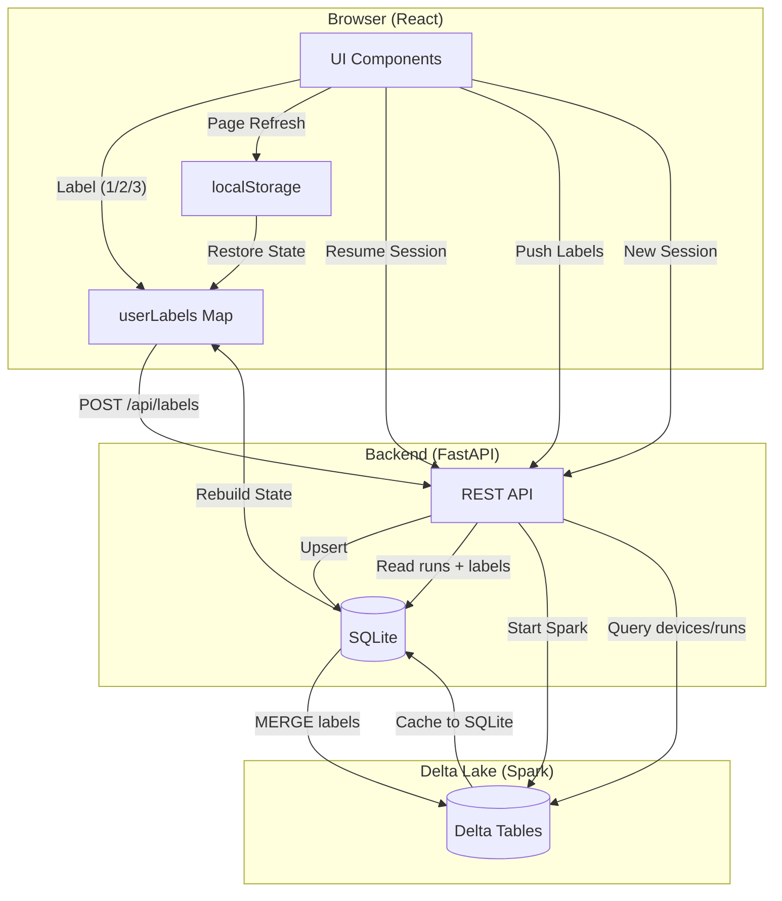
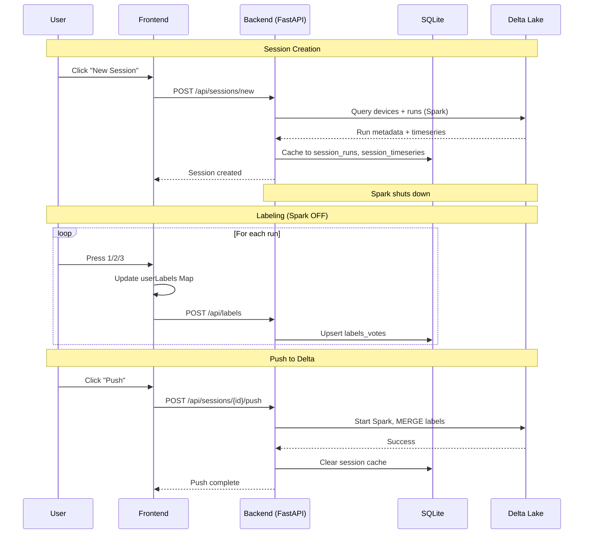

# Signal Labeler

A web-based tool for labeling time-series and signal data with session management, multi-device support, and Delta Lake persistence.

## Labels

| Key | Label | Description |
|-----|-------|-------------|
| 1 | Class A | Primary classification |
| 2 | Class B | Secondary classification |
| 3 | Invalid | Segmentation or detection error |

## Quick Start (Docker)

```bash
# 1. Start containers in background
docker compose up -d --build

# 2. Seed demo data (first time only)
docker compose exec backend python sync.py seed

# 3. View logs (optional)
docker compose logs -f
```

Open http://localhost

**Options:**
```bash
# Set your labeler name
docker compose up -d --build
docker compose exec -e LABELER_NAME=YourName backend python sync.py seed

# Seed with more data
docker compose exec backend python sync.py seed --devices 20 --days 30 --runs-per-day 20
```

### Windows (WSL2)

For `localhost` to work from Windows, enable mirrored networking:

1. Create `%USERPROFILE%\.wslconfig`:
```ini
[wsl2]
networkingMode=mirrored
```

2. Restart WSL: `wsl --shutdown`

Or use `start.bat` for one-click launch (opens browser automatically).

### Troubleshooting

**Changes not showing after rebuild?**

Docker caches build layers for speed. If your code changes aren't picked up:

```bash
docker compose down
docker compose build --no-cache
docker compose up
```

This forces a full rebuild (~2-5 min vs ~30 sec). Only needed when cache gets stale - typically after modifying frontend files that Docker's change detection misses (common on WSL2).

## Manual Installation

### Prerequisites
- Python 3.10+
- Node.js 18+
- Java 8+ (for Spark)

### Backend
```bash
cd backend
python -m venv venv
source venv/bin/activate  # Windows: venv\Scripts\activate
pip install -r requirements.txt

# Seed demo data (first time only)
python sync.py seed

# Start server
uvicorn app.main:app --reload --port 8000
```

### Frontend
```bash
cd frontend
npm install
npm run dev
```

Open http://localhost:5173

## Architecture

The labeler uses a **hybrid local-first architecture**:

```
SQLite (Local Cache)     Spark/Delta Lake (Cloud)
├── Fast UI operations   ├── Device discovery
├── Session state        ├── Label persistence
└── Label cache          └── Data source of truth
```

### System Flow



### Data Flow: Labeling Session



### Session Flow

1. **Launch Page** - Query devices from Delta Lake
2. **Create Session** - Pull runs/timeseries to SQLite cache
3. **Labeling** - Fast local queries (Spark off)
4. **Push** - MERGE labels to Delta Lake

### Cluster Management

- Spark starts on-demand (Query, Push)
- Auto-shuts down after 3 minutes idle
- Status indicator: red (off), yellow (starting), green (on)

## Keyboard Shortcuts

### Navigation & Labeling
| Key | Action |
|-----|--------|
| `←` / `→` or `Shift` / `Space` | Navigate runs |
| `H` | Jump to first unlabeled run |
| `N` | Jump to last unlabeled run |
| `Ctrl+Z` | Go back to previous labeled run |
| `1` `2` `3` | Apply label (Class A / Class B / Invalid) |
| `Ctrl+Enter` | Load runs (from device filter) |

### Chart Controls
| Key | Action |
|-----|--------|
| `Q` / `E` | Slide time window left/right |
| `J` / `L` | Expand boundaries outward |
| `U` / `O` | Shrink boundaries inward |
| `A` | Auto scale Y-axis |
| `S` | Full scale Y-axis |
| `C` | Toggle colorblind mode |
| `R` | Reset chart view |

### Session
| Key | Action |
|-----|--------|
| `Esc` | Early exit (submit prompt if all labeled) |
| `Y` | Push to Delta (in submit prompt) |
| `N` / `Esc` | Save for later (in submit prompt) |
| `?` | Show all shortcuts |

## Session Management

### Save States (Max 3)
- Sessions persist across browser refreshes
- Progress colors: red (<70%), yellow (70-89%), green (90-100%)
- Each session tracks: devices, date range, labels, progress

### Multi-Device Sessions
- Load multiple devices in one session
- DeviceNavigator shows Available/Finished dropdowns
- Per-device progress tracking

### Push Workflow
1. Complete all runs → "All Runs Labeled" modal
2. Press Y to push or N to save for later
3. Labels synced to Delta Lake via MERGE
4. Session auto-clears on successful push

## API

| Method | Endpoint | Description |
|--------|----------|-------------|
| GET | `/api/devices` | List devices from SQLite |
| GET | `/api/delta/devices` | Query devices from Delta Lake |
| POST | `/api/runs/sample` | Sample unlabeled runs |
| GET | `/api/runs/{id}` | Get run with timeseries |
| POST | `/api/labels` | Submit label vote |
| GET | `/api/cluster/status` | Spark cluster status |
| GET | `/api/sessions` | List saved sessions |
| POST | `/api/sessions/new` | Create new session |
| POST | `/api/sessions/{id}/push` | Push labels to Delta |

Docs: http://localhost:8000/docs

## Configuration

### Environment Variables

```bash
# Labeler name (optional, defaults to system username)
LABELER_NAME=YourName

# Spark settings (auto-configured)
DELTA_TABLE_PATH=./data/delta
SPARK_LOCAL_THREADS=4
SPARK_DRIVER_MEMORY=4g
```

## Concepts & Learning

This project uses several technologies. Here's how they fit together:

### Docker Architecture

**Images vs Containers vs Volumes**

| Concept | Analogy | Description |
|---------|---------|-------------|
| **Image** | Game installer | Cached build with all dependencies. Created by `docker build`. |
| **Container** | Running game | Live instance of an image. Created by `docker run`. |
| **Volume** | Save file | Persistent data that survives container restarts. |

```
Dockerfile          →  Image           →  Container
(build recipe)         (cached build)     (running instance)
                                              ↓
                                          Volume
                                       (persistent data)
```

**Key Commands**
```bash
docker compose up --build      # Foreground (see logs, Ctrl+C stops)
docker compose up -d --build   # Detached (runs in background)
docker compose down            # Stop and remove containers
docker compose logs -f         # Follow logs (detached mode)
docker compose exec backend sh # Shell into running container
```

**Why `--no-cache`?**

Docker caches each build step. If `requirements.txt` hasn't changed, it skips `pip install`. Use `--no-cache` when:
- Dependencies updated but file unchanged
- Build is acting stale

```bash
# Rebuild just backend without cache
docker compose build backend --no-cache
docker compose up -d
```

### Frontend Build Pipeline

```
TypeScript (.ts/.tsx)  →  Vite/npm build  →  JavaScript  →  nginx serves
     (source)             (bundler)          (browser)      (web server)
```

**File Types**
- `.ts` - TypeScript logic (hooks, services, types)
- `.tsx` - TypeScript + JSX (React components with UI)

**Tool Roles**

| Tool | Role | When Used |
|------|------|-----------|
| **npm** | Package manager | Install dependencies, run scripts |
| **Vite** | Dev server + bundler | Development (hot reload) and build |
| **nginx** | Static file server | Production (serves built files) |

**Development vs Production**
```bash
# Development (Vite - hot reload)
cd frontend && npm run dev     # localhost:5173
# Stop: Ctrl+C

# Production (nginx - optimized)
docker compose up              # localhost:80
# Stop: docker compose down
```

### Project Architecture Layers

```
┌─────────────────────────────────────────────────────────────┐
│  Browser (React)                                            │
│  └── Components (.tsx) → Hooks → Services → fetch("/api")   │
├─────────────────────────────────────────────────────────────┤
│  nginx (Docker) or Vite (dev)                               │
│  └── Proxies /api/* to backend:8000                         │
├─────────────────────────────────────────────────────────────┤
│  FastAPI Backend                                            │
│  └── Endpoints → Repositories → SQLite / Spark              │
├─────────────────────────────────────────────────────────────┤
│  Data Layer                                                 │
│  ├── SQLite: Local cache, sessions, labels                  │
│  └── Delta Lake: Source of truth (via Spark)                │
└─────────────────────────────────────────────────────────────┘
```

### Spark in Docker

Spark runs in **local mode** inside the backend container:
- No external cluster needed
- Memory configured via environment variables
- UI available at http://localhost:4040 (when cluster is running)

```yaml
# docker-compose.yml
environment:
  - SPARK_DRIVER_MEMORY=32g   # Heap for Spark operations
  - SPARK_EXECUTOR_MEMORY=16g # Worker memory
deploy:
  resources:
    limits:
      memory: 48g              # Container hard limit (must exceed driver+executor)
```

### Common Pitfalls

**404 errors after seeding new data?**

Old browser session pointing to deleted runs. Clear localStorage:
1. DevTools (F12) → Application → Storage
2. Click "Clear site data"

**Stale frontend after code changes?**

```bash
docker compose down
docker compose build frontend --no-cache
docker compose up -d
```

## Requirements for New Users

### Python Dependencies
```
fastapi
uvicorn
pyspark==3.5.2
delta-spark==3.2.0
```

### System Requirements
- **Java**: Required for Spark (JDK 8, 11, or 17)
- **Memory**: 4GB+ recommended for Spark operations
- **Disk**: Space for Delta Lake tables and SQLite cache

### Common Issues

1. **"Java not found"** - Install JDK: `apt install openjdk-11-jdk`
2. **Spark memory errors** - Increase `SPARK_DRIVER_MEMORY`
3. **Delta table not found** - Run initial data seeding
4. **WSL2 network issues** - Enable `networkingMode=mirrored`
5. **Switching from Docker to local dev** - Docker creates `backend/data` with root ownership. Remove it first: `sudo rm -r backend/data`, then re-seed.

## License

Apache 2.0 - See [LICENSE](LICENSE)
