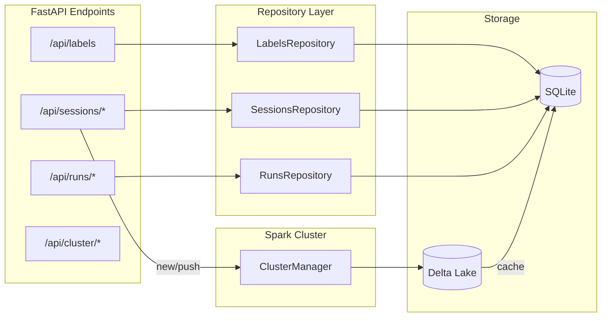
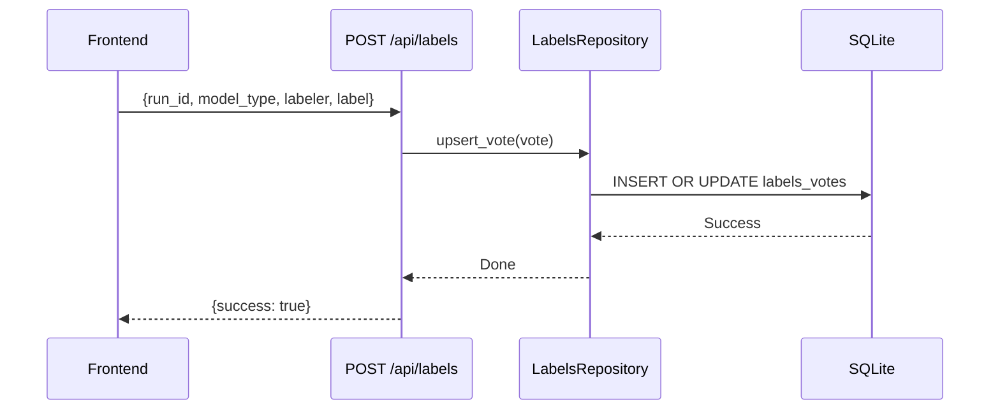
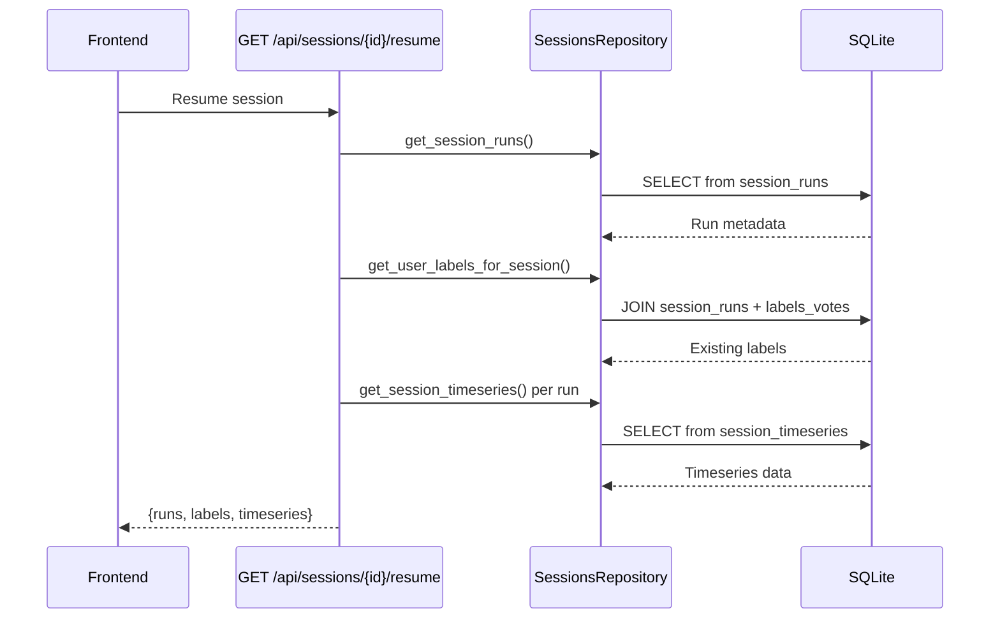

# Signal Labeler - Backend

FastAPI backend for the time-series classification labeling application.

## Setup

### Prerequisites
- Python 3.10+

### Installation

1. Create a virtual environment:
```bash
python -m venv venv
source venv/bin/activate  # On Windows: venv\Scripts\activate
```

2. Install dependencies:
```bash
pip install -r requirements.txt
```

3. Initialize and seed the database:
```bash
python seed.py
```

This will create:
- 10 devices (`device_001` to `device_010`)
- ~300 RLE runs per device
- 30 days of synthetic time-series data
- Date range: 2024-01-01 to 2024-01-31

### Run the Server

```bash
uvicorn app.main:app --reload --port 8000
```

The API will be available at `http://localhost:8000`

API documentation: `http://localhost:8000/docs`

## API Endpoints

### GET /api/devices
Get list of device IDs in a time range.

Query params:
- `start_ts` (float): Unix timestamp
- `end_ts` (float): Unix timestamp

### POST /api/runs/sample
Sample unlabeled runs for labeling.

Request body:
```json
{
  "device_id": "device_001",
  "start_ts": 1704067200,
  "end_ts": 1706745600,
  "model_type": "classification_v1",
  "sample_size": 50,
  "unlabeled_only": true
}
```

### GET /api/runs/{run_id}
Get full run details including timeseries and label status.

Query params:
- `model_type` (optional): Model type for label filtering

### POST /api/labels
Submit a label vote.

Request body:
```json
{
  "run_id": "device_001_run_00001",
  "model_type": "classification_v1",
  "labeler": "john",
  "label": 0,
  "notes": ""
}
```

Label values:
- `0`: class_a
- `1`: class_b
- `2`: invalid

### GET /api/labels/status/{run_id}
Get label status for a run.

Query params:
- `model_type` (optional): Model type

## Architecture

### Data Flow



### Label Submission Flow



### Session Resume Flow



### Repository Pattern
The backend uses a repository pattern to abstract data access:

- `repositories/base.py`: Abstract interfaces
- `repositories/sqlite_runs.py`: SQLite implementation for runs
- `repositories/sqlite_labels.py`: SQLite implementation for labels

This design allows easy swapping to Databricks later by creating new repository implementations without changing the API layer.

### Database Schema

**rle_runs**: RLE run segments
- Primary key: `run_id`
- Indexed on: `(device_id, start_ts)`

**timeseries_data**: Time-series points
- Indexed on: `(run_id, ts)`

**labels_votes**: Label votes (supports multiple labelers)
- Primary key: `(run_id, model_type, labeler)`
- Indexed on: `(run_id, model_type)`

**devices**: Device metadata cache

## Configuration

Edit `.env` to configure:
- `DATABASE_URL`: SQLite database path
- `DATA_BACKEND`: `sqlite` or `databricks` (future)
- `MODEL_TYPE_DEFAULT`: Default model type
- `CORS_ORIGINS`: Allowed frontend origins

## Troubleshooting

### `Mkdirs failed to create file:/.../data/delta/devices`

If you see this error when running `python sync.py seed`:

```
java.io.IOException: Mkdirs failed to create file:/home/.../backend/data/delta/devices
```

This happens when the `data/` directory was previously created by Docker (as root) and your local user doesn't have write permissions.

**Fix:**
```bash
sudo rm -rf data/
# Or to preserve existing data:
sudo chown -R $USER:$USER data/
```

Then run `python sync.py seed` again.
