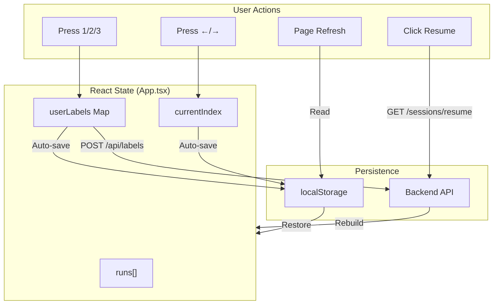
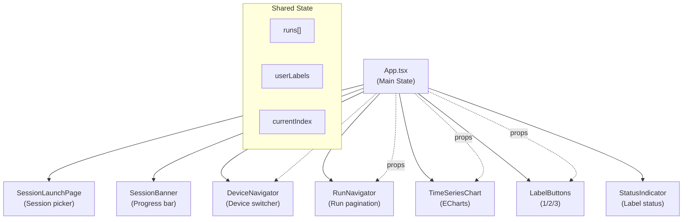
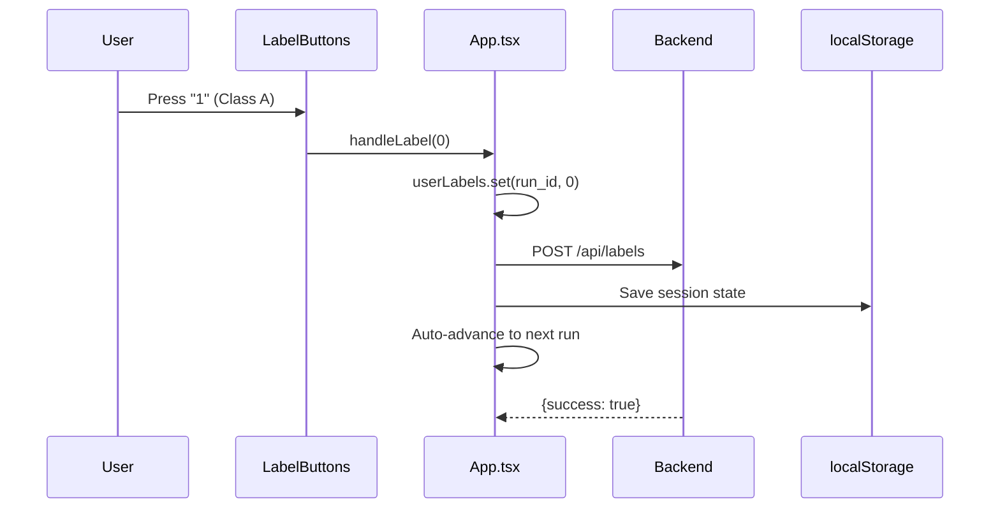

# Signal Labeler - Frontend

React + TypeScript + Vite frontend for the signal labeling application.

## Architecture

### State Management Flow



### Component Hierarchy



### Label Flow



## Setup

Install dependencies:
```bash
npm install
```

## Development

Start dev server:
```bash
npm run dev
```

Runs at `http://localhost:5173`

## Build

Production build:
```bash
npm run build
```

Preview production build:
```bash
npm run preview
```

## Environment Variables

Create a `.env` file:
```
VITE_API_BASE_URL=http://localhost:8000
```

## Components

- **DeviceSelector**: Device and session configuration
- **RunNavigator**: Navigation and progress tracking
- **TimeSeriesChart**: ECharts visualization
- **LabelButtons**: Label selection UI
- **StatusIndicator**: Shows label status

## Hooks

- **useKeyboardNav**: Keyboard shortcuts handler
- **useRunsData**: Data fetching and state management

## Keyboard Shortcuts

- **← (Left)**: Previous run
- **→ (Right)**: Next run
- **0**: Class A label
- **1**: Class B label
- **2**: Invalid label
